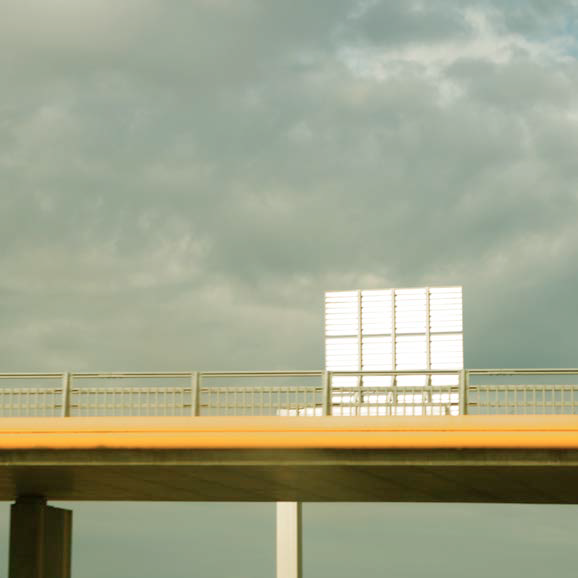
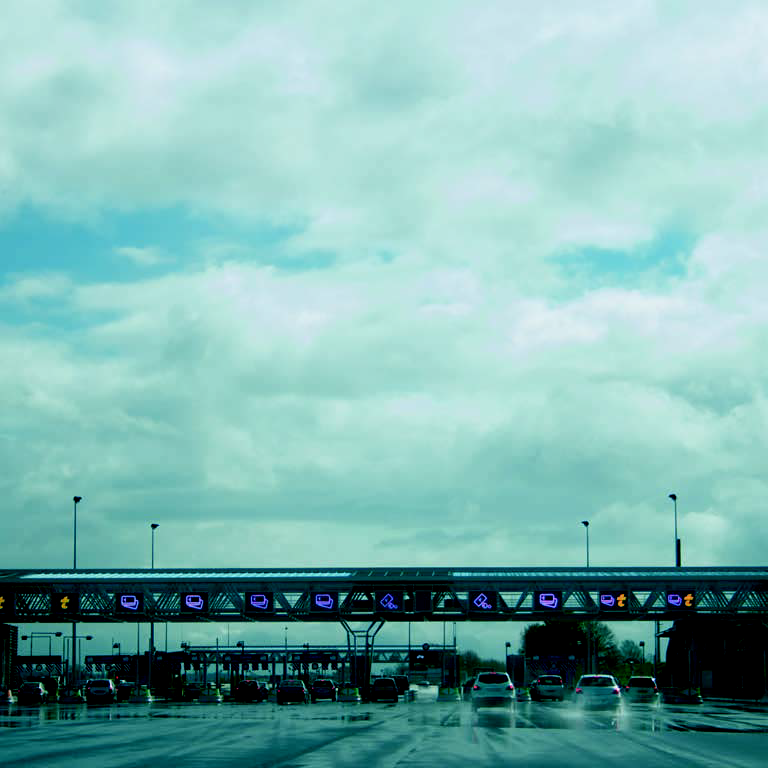
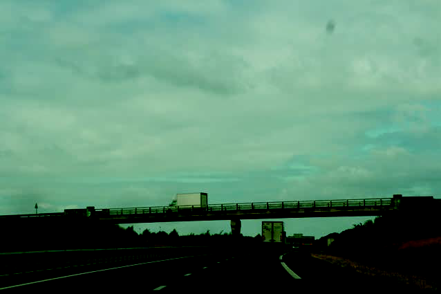
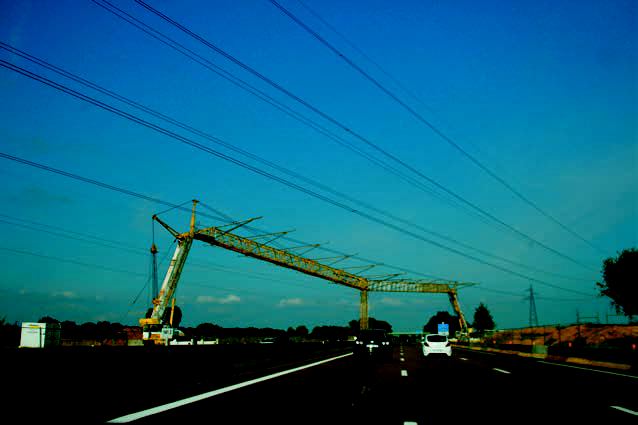
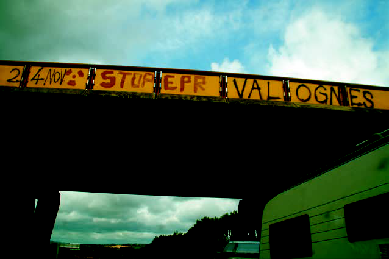
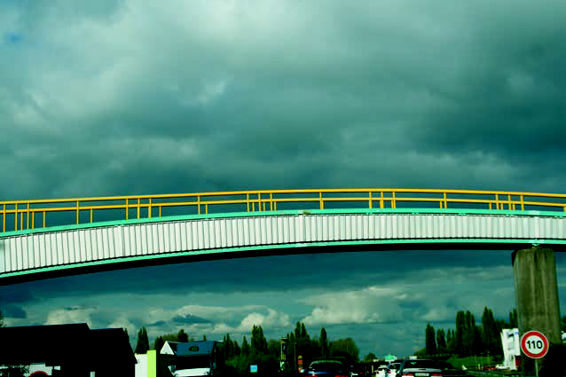
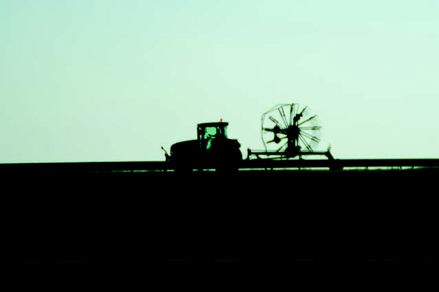
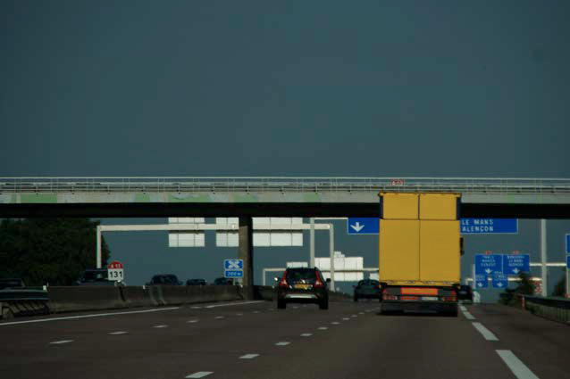

	title: Auto-graphe
	---

# Auto-graphe

Je ne suis pas de là-bas, mais c'est comme si j'y étais née, un 25 avril, quelque part sur une autoroute, entre Jaipur et Pali. Cinq jours.  
Cinq nuits. 1200km parcourus. Une Ambassador - abri, lit, cocon - et un chauffeur sikh, pour seuls compagnons de route, fantômes d'une Inde en suspension…

Tout mon temps, je le passe sur la route. Ou presque.

L'autoroute, est immense, impossible à photographier. Un vide énorme qu'il faudrait remplir nécessairement - mais les vitesses sont inadaptées.  
Le temps défile, rythmé par l'alternance des bandes blanches et noires qui marquent les bas-côtés. Et par l'allure molle d'une conduite qui s'en remet, fatalement, aux dieux qui nous observent.

Une route rajasthanie,  
Ça change tout le temps, ça grouille de partout.  
Ça grouille et ça vaque à des occupations minuscules.
Ça pédale, ça se faufile.  
Ça piaille, ça dort.  
Ça fait un boucan d'enfer.  
Ça sent bon le Tchaï.  
Ça prie et ça blasphème.  
Ça reste muet parfois.

